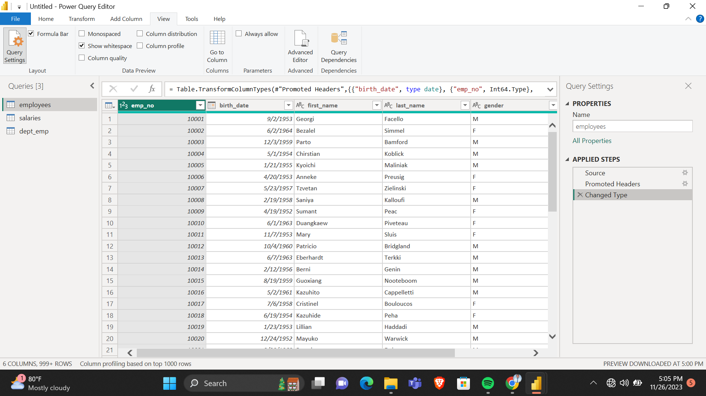
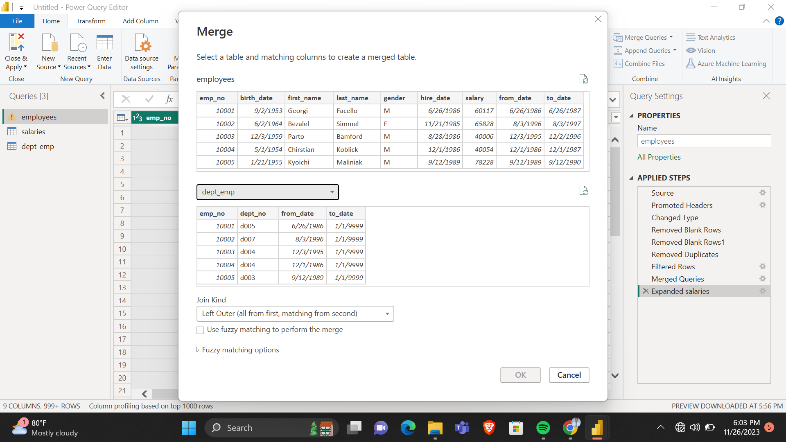

# Data Cleaning and Transformation with Power BI

## Introduction: 
This is a task to practise and understand the principalities of data cleaning and transformation. **Disclaimer**: this work does not represent the work of any institution.

## Problem Statement: 
Extensively clean the ‘Employee, Salary and Department’ datasets provided. Practice joining of tables by combining the Employee, Salary and Department tables into one table. 

### Data Sourcing: 
This dataset was provided by my tutor to practise with. 

## Skills demonstrated:
•	Data cleaning

•	Duplicate removal

•	Data transformation

•	Merge queries function

## Work Done: 

-	The dataset was profiled to check for the structure, content and quality of the data.
-	Data types were checked and all columns are changed to their appropriate data types.
  
  
  
-	Missing values were checked for and none found. 
-	Duplicates were checked for and all duplicates were removed. 
-	Blank rows were checked for and all blank rows were removed. 
-	The tables were joined together using the merge queries option as shown in the image below.

  

Conclusion: This documentation is to practise what was learnt during the data cleaning and transformation task. 
